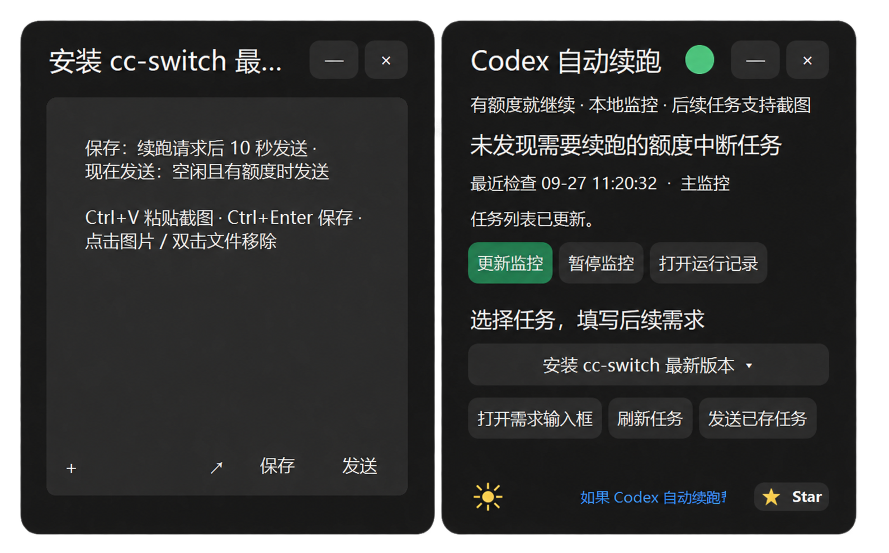

# Codex Quota Resume · Codex 额度恢复自动续跑

[简体中文](README.md) | [English](README.en.md)

**Windows Beta / macOS Developer Preview（开发预览）**。macOS 移植和监控配置兼容性修复已合入 `main`，请从主分支继续开发。macOS 尚未完成目标设备及真实额度恢复验收。

[桌面版下载 / Downloads](https://github.com/JOEJOEHA/codex-quota-resume/releases/latest) · [参与贡献 / Contributing](CONTRIBUTING.md) · [给朋友的 Codex 交接 Prompt / macOS Handoff](docs/macos-handoff.md) · [macOS 构建与验收](docs/macos.md)

为因额度耗尽而中断的 Codex 任务提供本地自动续跑。主监控读取日志，备用监控直接读取 Codex 任务状态；发送前检查**实时可用额度**，不要求旧日志显示 100%，也不固定多等五分钟。

**这是测试版，不保证所有 Codex 版本和异常场景都能自动恢复。** 已测试实时查询、后台直接续跑、失败处理及防重复；尚未完成新版在真实额度耗尽—恢复周期中的验收。

## 它包含什么

- 主监控每分钟检查，备用监控每五分钟独立检查。
- 两层共用进程锁和发送记录，避免重复启动。
- 通过 `codex exec resume` 继续原任务；若桌面端已有写入者，使用 `codex queue` 交给现有桌面任务执行。入队后仍需观察启动，不把入队当作完成。不新建任务，不主动更改模型或购买额度。
- 深色圆角后续任务输入框，显示任务名称，支持图片、文件、粘贴截图和 Windows 截图工具；图片不设固定数量上限，缩略图可横向滚动。
- 输入框右下角的 ↗ 可展开为独立大窗口，关闭大窗口会带回文字。保存后，任务选择框显示红旗并红绿闪动五次，红旗保留至任务已交给 Codex。
- 监控查询不调用模型；真正续跑会正常消耗 Codex 额度。

提供 **Windows 本地 EXE + Windows 计划任务 + 可选 Codex Skill**。EXE 已包含 Python、Tkinter 和 Pillow，无需另外安装 Python。

## 下载本地软件（推荐）

[下载 Windows EXE（v3.0.0-beta.39）](https://github.com/joejoeha/codex-quota-resume/releases/download/v3.0.0-beta.39/CodexQuotaResume.exe) · [Windows 发布说明](https://github.com/joejoeha/codex-quota-resume/releases/latest) · [macOS 预览版下载](https://github.com/joejoeha/codex-quota-resume/releases/tag/v3.0.0-beta.36)

beta.39 仅更新 Windows：移除灰色输入区域内重复显示的任务标题；顶部窗口标题、长标题省略和展开编辑窗口标题保持不变。

M1 / M2 / M3 等 Apple Silicon 芯片选择 `macOS-arm64-preview.zip`；Intel Mac 选择 `macOS-x86_64-preview.zip`。两种架构均已通过 CI 构建，不代表每种芯片或目标设备都已实机验收。macOS 预览仅有 ad-hoc 签名，尚无 Developer ID 签名与 Apple 公证。

macOS 源码开发、构建及本机验证见 [macOS 开发说明](docs/macos.md)。本分支支持从 `Codex.app` 或包含 Codex CLI 的 `ChatGPT.app` 自动查找可执行文件，适用于 Finder 启动时没有终端 PATH 的情况；`--doctor` 会逐项输出兼容性检查结果，失败时保留已完成的检查并返回非零退出码。

主界面最小化或关闭后保留在系统托盘，点击循环箭头图标恢复，右键可打开或退出界面。退出界面不停止后台计划任务；若有打开的草稿，关闭草稿后再退出。输入框仍可从任务栏恢复。

Windows 多次启动程序、打开多个主窗口时共用一个托盘图标。点击图标恢复所有主窗口；右键可打开所有主窗口或退出所有界面，仍保留未关闭的草稿。持有图标的进程退出后，其他进程自动接管。更新后需从旧版托盘菜单退出所有旧实例，再使用新版，才能消除旧版图标。

主界面与输入框采用统一深色圆角外观、标题字号和任务菜单宽度，可拖动标题栏或空白边缘移动窗口。绿色圆点代表主备监控均已启用，红色代表未全部启用或无法确认；状态每五秒读取实际计划任务。

双击打开，点击 **启用 / 更新监控**。程序会安装到 `%LOCALAPPDATA%\CodexQuotaWatcher`，复用主备计划任务并创建桌面快捷方式。在软件中选择任务，再点“打开需求输入框”即可填写文字、加入截图。关闭主界面不会停止后台计划任务；暂停使用“暂停监控”。

## 环境要求

- Windows 10/11；电脑开机、用户保持登录、网络可用。
- 仅源码安装需要 Python 3.11+，包含 Tkinter；`python`、`pythonw` 可从终端调用。
- 仅源码安装需要 Pillow 图片库。
- 已登录的 Codex CLI，支持 `exec resume`、`app-server --stdio`、`account/rateLimits/read` 和 `thread/turns/list`。最后一项属于实验接口，Codex 更新可能影响兼容性。

## 源码 / Skill 安装

[下载可安装的技能包](https://github.com/JOEJOEHA/codex-quota-resume/raw/refs/heads/main/codex-quota-resume.zip) · [源代码](https://github.com/JOEJOEHA/codex-quota-resume)

下载本仓库 ZIP 并解压，或用 Git 克隆。在仓库目录打开 PowerShell：

```powershell
python -m pip install -r requirements.txt
& .\scripts\install_windows.ps1
```

如果系统策略禁止运行脚本，请遵循你的设备或组织策略；本项目不修改系统执行策略。

也可以把仓库链接发给 Codex：

> 请阅读这个仓库的 README 和 SKILL.md，检查 Windows 和 Codex CLI 兼容性，然后安装自动续跑并验证两个计划任务。

若需要在 Codex 中直接使用 Skill，将本仓库解压为 Codex Skills 目录下的 `codex-quota-resume` 文件夹（其中应直接包含 `SKILL.md`）。仅复制 Skill 不会启用后台监控，仍需运行安装脚本。

安装后会创建：

| 项目 | 位置或名称 |
|---|---|
| 程序与运行状态 | `%LOCALAPPDATA%\CodexQuotaWatcher` |
| 主计划任务 | `Codex Quota Resume Watcher` |
| 备用计划任务 | `Codex Quota Resume Backup` |

默认只处理监控启用后发生的额度中断，不自动重启历史遗留任务。

## 查看、暂停、恢复、卸载

```powershell
& .\scripts\manage_windows.ps1 status
& .\scripts\manage_windows.ps1 pause
& .\scripts\manage_windows.ps1 resume
& .\scripts\manage_windows.ps1 uninstall
```

暂停会禁用两层的后续调度，不中止已经执行的任务。卸载保留本机需求、图片和运行记录；确认不再需要后可自行删除上述安装目录。不要只停用主层，否则备用层仍会工作。

## 后续任务与截图

额度中断时可填写后续任务。手动打开：

```powershell
& "$env:LOCALAPPDATA\CodexQuotaWatcher\CodexQuotaResume.exe" --plan <任务UUID>
```

`Ctrl+V` 粘贴截图，`Ctrl+Enter` 保存。截图按钮打开 Windows 截图工具，截图后回到输入框粘贴。图片没有固定数量上限，缩略图横向滚动。

从 beta.25 起，续跑请求被接受后等待 10 秒，已保存的需求会直接请求加入原会话队列，不等待原任务完成或 `[QUOTA_RESUME_GOAL_COMPLETE]` 标记。发送前仍检查实时额度；10 秒是最短等待时间，额度不可用时继续等待。未发生续跑时，“保存”仅保存需求。延迟投递期间原任务取消，待发内容会保留为草稿并停止自动投递；需要手动重新保存或发送。

“现在发送 ↑”和“发送已存任务”是用户明确要求发送新指令，会在监控下一次检查、当前会话正常结束且实时额度可用时发送，不要求此前发生额度中断或出现完成标记。主备监控持续检查保存记录；界面显示具体等待原因。若 CLI 明确拒绝图片入队，会把已保存图片的本地路径随文字交给原会话读取。入队只表示已接收，仍检查后续启动，不重复发送。

## 数据与边界

弹窗只有在窗口已显示并发回确认后才标记为已提示；启动失败会留下记录并在后续检查重试。

程序读取本机 Codex 日志、官方本地 App Server 状态及当前账户额度，使用已有 Codex 登录。它不读取或上传登录令牌，不兑换重置券，不购买额度。保存的文字、截图和状态留在本机；实际发送任务及图片时会交给 Codex 按正常服务流程处理。

不要把安装目录、日志、状态文件或截图提交到 GitHub。报告问题时只提供脱敏错误和版本信息。

关机、断网、登录失效、需要人工批准、接口变化或监控进程卡住都可能影响续跑。备用层有独立的任务发现路径，但仍共享 Windows、Python、Codex 和网络，并非完全独立的系统。无法确认是否已启动时，优先防止重复执行。

## 开发验证

```powershell
python scripts/quota_watcher.py --self-test
python scripts/test_watcher.py
python scripts/test_backup.py
python scripts/test_live_status.py
python scripts/test_popup.py
python scripts/test_app.py
```

这些测试使用临时目录和模拟响应，不会向真实任务发送消息。Windows CI 运行相同测试。测试通过不等于已完成真实额度恢复验收。

在已登录且 Explorer 正常运行的 Windows 桌面上，运行 `python scripts/test_tray.py`、`python scripts/test_tray_multi.py` 和 `python scripts/test_inprocess.py` 验证单图标、多进程接管与窗口/草稿。托盘测试使用独立分组，不控制正在运行的用户窗口。

## 构建 EXE

```powershell
python -m pip install -r requirements.txt pyinstaller
& .\scripts\build_windows.ps1
```

生成 `dist/CodexQuotaResume.exe`。构建产物及运行记录不提交到源代码仓库。

## 许可与贡献

MIT 许可。这是独立社区项目，非 OpenAI 官方产品。完整英文说明见 [English README](README.en.md)，朋友接手 macOS 请使用 [中英文交接 Prompt](docs/macos-handoff.md) 和 [贡献指南](CONTRIBUTING.md)。

文件附件：在需求弹窗点击“+ 添加 → 添加文件”。文件复制保存到本机，续跑时将本地路径随需求提供给 Codex。双击文件名或选中后按 Delete 移除附件。

主界面直接在当前进程打开需求弹窗，同一任务重复点击会唤回已有草稿。关闭主窗口会保留仍在编辑的弹窗；后台监控在主程序关闭时仍可用同一个 EXE 单独显示弹窗。

需求弹窗打开或唤回时优先贴靠主窗口右侧，空间不足则放左侧，顶部对齐，间距 6 像素。根据当前显示器工作区定位，避免遮住主窗口。

多个输入窗会按打开顺序在主窗口同一侧排放，间隔 6 像素；可调整整组位置或换行，避免互相覆盖。屏幕容量不足时提示先保存关闭或最小化一个输入窗；不会把窗口叠放或移出工作区。

### 应用内更新（Windows）

主窗口左下角的按钮平时显示当前版本号；启动后会在后台查询 GitHub Releases，发现可安装的 Windows 新版时变蓝并显示“检查更新”。点击后下载更新、验证 SHA256 并自动安装。右下角的 Star 按钮可自愿为项目点星。安装成功后打开新版；旧窗口中的草稿仍可继续保存。任务、附件、监控启用/暂停状态保留。macOS 开发预览支持手动检查新版、查看发布说明并打开下载页，安装仍需手动完成。

### 额度中断自动输入窗

检测到明确的额度耗尽中断时，运行中的主界面约每 5 秒检查并自动打开对应任务输入窗，复用已有草稿；同一次中断只弹一次。主界面未运行时由定时监控在下一次检查时打开。单纯额度为零、网络错误或正常完成不会触发。

### 续跑后的延迟发送

已保存的需求会在续跑请求被接受后等待 10 秒，直接请求加入对应会话，无须验收标记，也无须等待原任务结束。发送前仍检查实时额度；已入队或已发送的需求不重复发送。未发生续跑时，“保存”仍仅保存需求，可用“现在发送”或“发送已存任务”主动提交。

## GitHub Star 集成（维护者配置）

桌面程序的“关于”窗口可查看公开 Star 数并自愿给项目点 Star。项目已配置公开 GitHub App Client ID；如果授权失败，按钮会打开项目页供用户手动操作，不会假装已 Star。已由 GitHub API 确认的 Star 会记录在现有 `state.json`，不保存 GitHub token、密码或浏览器 Cookie；提醒最多每 7 天出现一次，验证后停止。网络不可用时不影响监控。

发布者需要在 GitHub **Settings → Developer settings → GitHub Apps → New GitHub App** 创建应用：

1. Homepage URL：`https://github.com/joejoeha/codex-quota-resume`。
2. User permissions：**Starring: Read and write**。Repository permissions：**Metadata: Read-only**。无需其他权限。
3. 启用 **Device Flow**，关闭 Webhook。本实现无需 Callback URL，表单可留空。
4. 仓库内已包含项目的公开 Client ID `Iv23linApcpGO7QHccqh`，普通用户无需配置。维护者若替换 GitHub App，可在构建前设置 `CODEX_QUOTA_GITHUB_CLIENT_ID` 覆盖默认值。例如 PowerShell：`$env:CODEX_QUOTA_GITHUB_CLIENT_ID='新的 Client ID'; & .\scripts\build_windows.ps1`。构建脚本不会包含 Client Secret。

本地源码测试可临时设置同一环境变量并运行 `python -X utf8 scripts/test_github_star.py`、`python -X utf8 scripts/app.py`。实际授权测试需要在 GitHub App 后台启用 Device Flow，然后在“关于”点击 Star，复制程序给出的代码到 GitHub 授权页。程序只在本次操作期间持有 access token；下次需要重新授权才能重新检查，已验证的本地状态仍会保留。

GitHub 当前[授权码流程文档](https://docs.github.com/en/apps/creating-github-apps/authenticating-with-a-github-app/generating-a-user-access-token-for-a-github-app)仍要求使用 Client Secret 换取 token，即使使用 PKCE；因此桌面程序不采用本地回调 + PKCE。这里使用 GitHub 官方的 [Device Flow](https://docs.github.com/en/apps/creating-github-apps/authenticating-with-a-github-app/generating-a-user-access-token-for-a-github-app#using-the-device-flow-to-generate-a-user-access-token)，只需 Client ID。没有服务器端密钥，也没有固定端口或本地回调服务。
